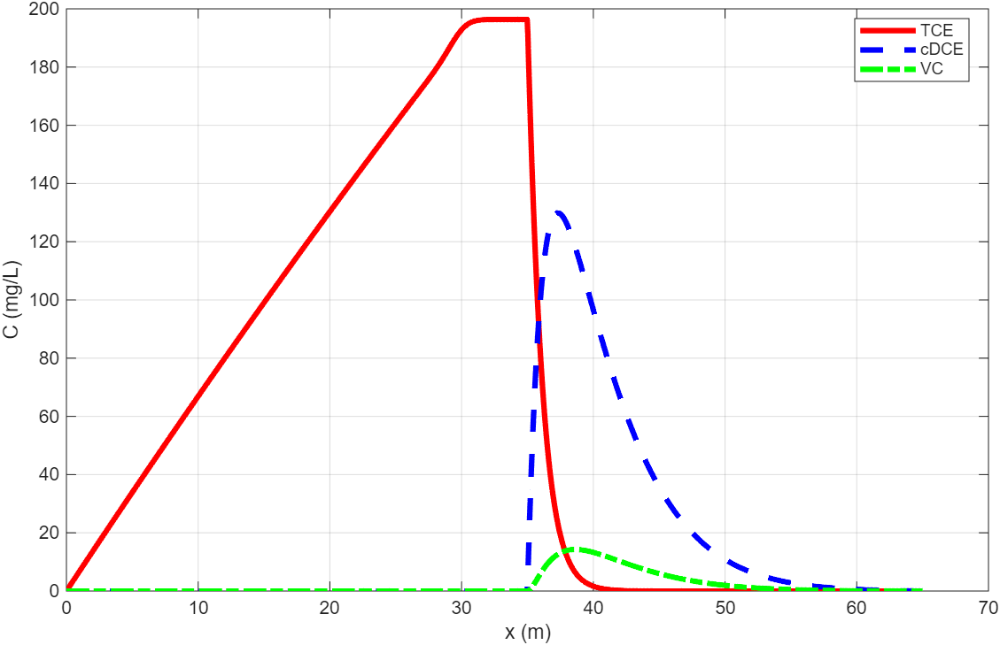
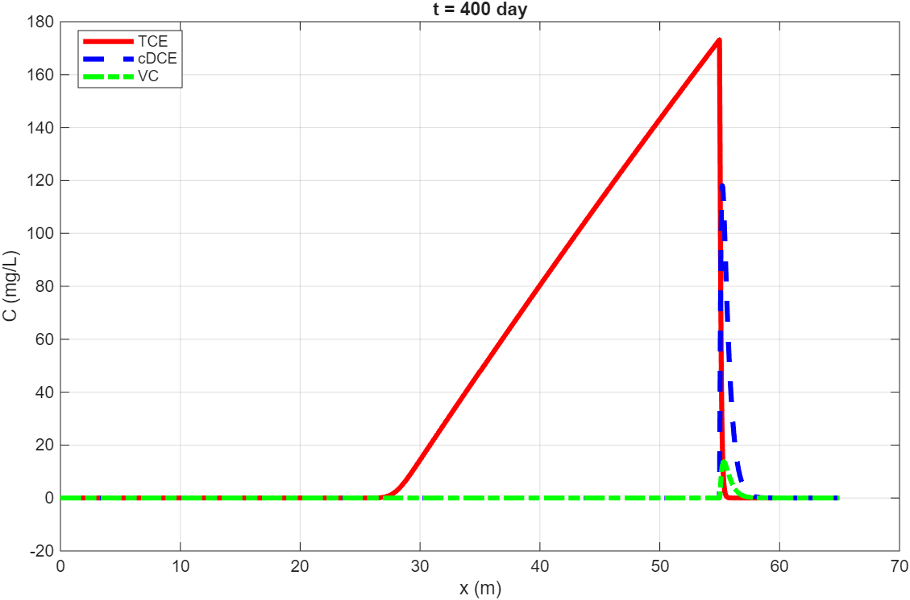
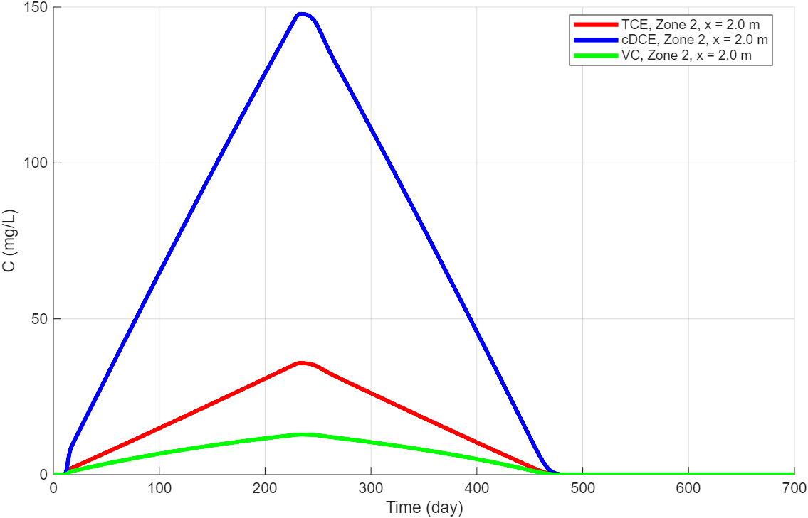
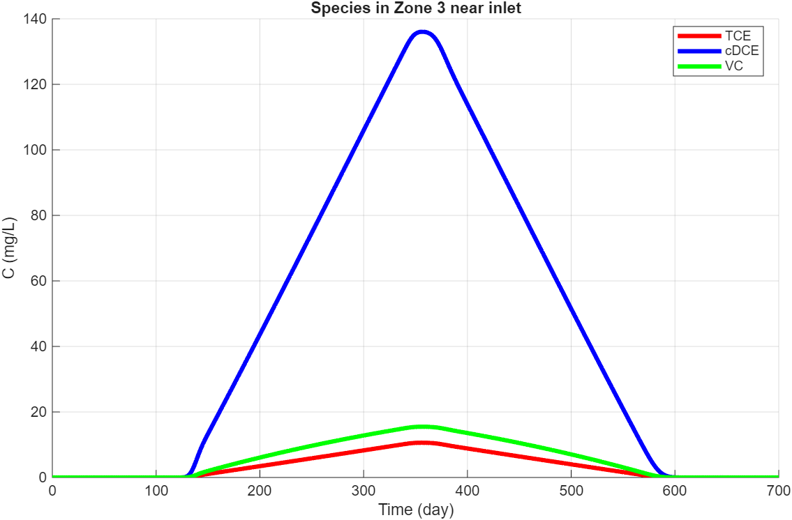

# One-Dimensional TCE Bioremediation Transport Model

A MATLAB finite-difference model for the transport and anaerobic reductive dechlorination of trichloroethylene (TCE) in groundwater. The model follows the transformation sequence:

**TCE → cis-1,2-dichloroethene (cDCE) → vinyl chloride (VC) → ethene/ethane**

The 65 m one-dimensional domain represents a simplified TCE plume extending from a source zone toward the Pasquotank River near the U.S. Coast Guard Support Center in Elizabeth City, North Carolina. Two conceptual remediation strategies are compared:

1. **Distributed biostimulation/bioaugmentation:** biodegradation occurs throughout the 30 m downgradient treatment zone.
2. **Permeable reactive biobarrier:** transport occurs through a 20 m transition zone before contaminants enter a 10 m reactive barrier.

The model combines advection, hydrodynamic dispersion, finite source release, and Monod-type biodegradation kinetics.

> **Academic-use note:** This is an educational course model, not a calibrated field-design tool.

## Representative results

> **Historical-results note:** The figures in this section were extracted from the course report. They have not yet been reproduced by the refactored executable code.

### Distributed treatment: concentration profiles at day 200



TCE remains source-controlled in Zone 1, while cDCE accumulates as the dominant intermediate in the reactive downgradient zone.

### Reactive barrier: concentration profiles at day 400



The PRB localizes the reaction near the end of the modeled domain and reduces TCE concentrations within the modeled barrier while daughter products form there.

### Example concentration-time behavior

| Distributed treatment | Permeable reactive barrier |
|---|---|
|  |  |

## Numerical formulation

The governing one-dimensional advection-dispersion-reaction equation is

$$
\frac{\partial C}{\partial t}
= -v_x\frac{\partial C}{\partial x}
+ D_x\frac{\partial^2 C}{\partial x^2}
+ R.
$$

Groundwater pore velocity is calculated from

$$
v_x = \frac{Ki}{n},
$$

and the longitudinal dispersion coefficient is represented as

$$
D_x = v_x\alpha_L + n\tau D_0.
$$

TCE release in the source zone is modeled using a mass-transfer term, while biodegradation in the reactive zone follows Monod-type kinetics. See [`docs/model-formulation.md`](docs/model-formulation.md) for the equations, boundary conditions, and numerical scheme.

## Repository structure

```text
.
├── run_all.m                         # Runs both refactored scenarios
├── src/
│   ├── run_method1_distributed.m     # Distributed treatment model
│   ├── run_method2_prb.m             # PRB treatment model
│   └── private/                      # Figure-export helpers
├── config/                           # Script/report parameter records
├── docs/                             # Model, results, references, and notes
├── results/
│   ├── report_figures/               # Figures extracted from the course report
│   └── generated/                    # New figures and CSV files after a run
└── archive/
    └── Term_Project_Bioremediation_original.m
```

## Running the model

1. Clone or download the repository.
2. Open MATLAB and set the repository root as the current folder.
3. Run:

```matlab
run_all
```

The refactored scripts write figures, CSV time series, and compact MAT result files to `results/generated/`.

The code uses rolling time layers rather than storing every concentration at every spatial and temporal node. This keeps the numerical update structure while substantially reducing memory use.

## Key outputs

The scripts generate:

- concentration-distance profiles at selected simulation times;
- concentration-time profiles at selected locations;
- TCE source-mass depletion curves;
- CSV files containing the selected time series;
- compact MAT files containing snapshots and model parameters.

## Reproducibility and parameter cross-check

The refactored executable scripts define the active parameter set used when `run_all.m` is run. Historical report/script differences are documented only in [`config/parameter_crosscheck.md`](config/parameter_crosscheck.md) and should be resolved before using the model for quantitative interpretation.

## Authorship

This repository is based on a CIVE 686 group project by **Hongting Chen, Jannatul Adan, and Yuxuan Wang**. The report states that MATLAB coding was shared by all three group members. See [`AUTHORS.md`](AUTHORS.md) and [`NOTICE.md`](NOTICE.md).

## Limitations

- The model is one-dimensional and uses simplified homogeneous zones.
- Parameter values are literature- or report-derived rather than site-calibrated.
- Chromium co-contamination is excluded.
- Biomass, electron-donor transport, geochemical competition, sorption, and complete daughter-product mass stoichiometry are simplified.
- The explicit finite-difference method requires appropriate spatial and temporal steps for numerical stability.

## Course context

Developed for **CIVE 686 Site Remediation** at McGill University as a term project on bioremediation and permeable reactive barriers.
